# Architecture & Tech Stack

This document describes the architecture, tech stack, APIs, data models, and user flows for VibeCraft v2.

---

## System Overview

```
User → Upload → Analyze → Create Sections → Plan Clips → Generate → Compose → Finalize → Download
```

## Core Components

1. **Audio Analysis**: Extract BPM (required), beats, genre, mood, lyrics with timestamps
2. **Section Management**: User creates sections after analysis, beat-aligned, labels added to prompts
3. **Clip Planning**: Plan 3-10 second clips per section (must exactly match section duration)
4. **Video Generation**: Generate clips via Replicate API, parallel with rate limiting
5. **Video Composition**: Stitch clips (already normalized from Phase 8), mux audio, handle mismatches
6. **Finalization**: Cleanup intermediates, no further edits

---

## Tech Stack

### Backend
- **Framework**: FastAPI (Python 3.10+)
- **Database**: PostgreSQL (SQLModel ORM)
- **Background Jobs**: RQ (Redis Queue) with Python workers
- **Storage**: AWS S3
- **Audio Processing**: librosa, ffmpeg
- **Video Processing**: ffmpeg-python
- **AI/ML**: Replicate API (video generation, Whisper for lyrics)

### Frontend
- **Framework**: React + TypeScript
- **Build Tool**: Vite
- **Styling**: Tailwind CSS (following DESIGN_SYSTEM)
- **State Management**: React Query (for API calls)
- **Video Player**: HTML5 video element

### Infrastructure
- **Backend Hosting**: Railway
- **Frontend Hosting**: Vercel
- **Storage & CDN**: AWS S3 + CloudFront
- **Containerization**: Docker (optional, for local development)
- **Environment**: Python venv, Node.js 18+
- **Version Control**: Git

---

## APIs and Service Providers

### External APIs

1. **Replicate API**
   - **Purpose**: Video generation, Whisper transcription
   - **Rate Limits**: Check Replicate docs, implement queue
   - **Cost**: Pay-per-use
   - **Authentication**: API token

2. **AWS S3**
   - **Purpose**: File storage (audio, video clips, final videos)
   - **Rate Limits**: High, not a concern
   - **Cost**: Storage + transfer costs
   - **Authentication**: AWS credentials

3. **CloudFront**
   - **Purpose**: CDN for video delivery
   - **Rate Limits**: High, not a concern
   - **Cost**: Data transfer costs
   - **Authentication**: AWS credentials

### Internal APIs

All services communicate via well-defined interfaces (see Architecture Diagram section).

---

## Architecture Diagram

```mermaid
graph TB
    subgraph "Frontend (React + TypeScript)"
        UI[User Interface]
        AuthUI[Auth Pages]
        VideoUI[Video Player]
        EditorUI[Section Editor]
    end

    subgraph "API Layer (FastAPI)"
        AuthAPI[Auth Endpoints]
        SongAPI[Song Endpoints]
        VideoAPI[Video Endpoints]
        UserAPI[User Endpoints]
    end

    subgraph "Service Layer (Internal APIs)"
        AuthSvc[Authentication Service]
        AnalysisSvc[Audio Analysis Service]
        BeatSvc[Beat Alignment Service]
        SectionSvc[Section Management Service]
        LyricSvc[Lyric Assignment Service]
        PromptSvc[Prompt Generation Service]
        ClipPlanSvc[Clip Planning Service]
        VideoGenSvc[Video Generation Service]
        NormalizeSvc[Video Normalization Service]
        ComposeSvc[Video Composition Service]
        RegenerateSvc[Regeneration Service]
        FinalizeSvc[Finalization Service]
        RateLimitSvc[Rate Limiting Service]
        StorageSvc[Storage Management Service]
        JobSvc[Job Orchestration Service]
    end

    subgraph "Data Layer"
        DB[(PostgreSQL)]
        S3[(AWS S3)]
        Redis[(Redis)]
    end

    subgraph "External Services"
        Replicate[Replicate API]
    end

    subgraph "Worker Services"
        Worker[RQ Worker]
    end

    UI --> AuthAPI
    UI --> SongAPI
    UI --> VideoAPI
    UI --> UserAPI

    AuthAPI --> AuthSvc
    SongAPI --> AnalysisSvc
    SongAPI --> SectionSvc
    VideoAPI --> VideoGenSvc
    VideoAPI --> ComposeSvc
    VideoAPI --> RegenerateSvc
    VideoAPI --> FinalizeSvc
    UserAPI --> RateLimitSvc
    UserAPI --> StorageSvc

    AuthSvc --> DB
    AnalysisSvc --> BeatSvc
    AnalysisSvc --> LyricSvc
    AnalysisSvc --> DB
    SectionSvc --> BeatSvc
    SectionSvc --> DB
    LyricSvc --> DB
    PromptSvc --> DB
    ClipPlanSvc --> DB
    VideoGenSvc --> Replicate
    VideoGenSvc --> S3
    NormalizeSvc --> S3
    ComposeSvc --> NormalizeSvc
    ComposeSvc --> S3
    RegenerateSvc --> VideoGenSvc
    FinalizeSvc --> StorageSvc
    RateLimitSvc --> DB
    StorageSvc --> S3
    StorageSvc --> DB
    JobSvc --> Redis
    JobSvc --> DB

    AnalysisSvc --> Redis
    VideoGenSvc --> Redis
    ComposeSvc --> Redis

    Worker --> Redis
    Worker --> AnalysisSvc
    Worker --> VideoGenSvc
    Worker --> ComposeSvc
    Worker --> DB
    Worker --> S3
```



---

## User Flows

### Flow 1: New User Registration & First Video

1. User visits site
2. User registers (email/password)
3. User uploads audio file
4. System analyzes audio (shows progress)
5. User sees analysis results + suggested video type
6. User creates sections (5-7, with labels/notes)
7. User approves/edits overall prompt
8. User clicks "Generate Video"
9. System generates clips (shows progress)
10. System composes final video
11. User sees final video
12. User can regenerate sections/clips (once each)
13. User clicks "Finalize"
14. System cleans up intermediates
15. Video is finalized (no further edits)

### Flow 2: Regeneration

1. User views video (not finalized)
2. User pauses video
3. User clicks "Regenerate"
4. System shows dialog: "Entire section" or "Just this clip"
5. System shows remaining regeneration count
6. User selects option
7. System regenerates (shows progress)
8. Video updates with new clip/section

### Flow 3: Video Library

1. User views library
2. User sees list of videos (shareable URL, delete button)
3. User can click shareable URL to view video
4. User can delete video (frees up quota)

---

## Data Models

### User
```python
class User(SQLModel, table=True):
    id: UUID
    email: str (unique)
    password_hash: str
    created_at: datetime
    video_count: int (default 0)
    storage_bytes: int (default 0)
```

### Song
```python
class Song(SQLModel, table=True):
    id: UUID
    user_id: UUID (FK)
    title: str
    duration_sec: float
    audio_s3_key: str
    created_at: datetime
```

### Analysis
```python
class Analysis(SQLModel, table=True):
    id: UUID
    song_id: UUID (FK)
    bpm: float
    beat_times: List[float] (JSON)
    genre: str
    mood_primary: str
    mood_tags: List[str] (JSON)
    mood_vector: dict (JSON)
    lyrics_available: bool
    lyrics: List[dict] (JSON)  # [{start, end, text}, ...]
    created_at: datetime
```

### Section
```python
class Section(SQLModel, table=True):
    id: UUID
    song_id: UUID (FK)
    section_index: int
    label: str
    start_time: float
    end_time: float
    prompt_note: str (optional, max 100 chars)
    regeneration_count: int (default 0)
    created_at: datetime
```

### Clip
```python
class Clip(SQLModel, table=True):
    id: UUID
    section_id: UUID (FK)
    clip_index: int
    start_time: float
    end_time: float
    prompt: str
    video_s3_key: str (optional)
    status: str  # planned, generating, completed, failed
    regeneration_count: int (default 0)
    created_at: datetime
```

### Video
```python
class Video(SQLModel, table=True):
    id: UUID
    song_id: UUID (FK)
    user_id: UUID (FK)
    video_type: str
    video_s3_key: str
    shareable_url: str
    duration_sec: float
    file_size_bytes: int
    is_finalized: bool
    created_at: datetime
    finalized_at: datetime (optional)
```

### Job
```python
class Job(SQLModel, table=True):
    id: UUID
    song_id: UUID (FK, optional)  # For analysis, generation, composition jobs
    video_id: UUID (FK, optional)  # For regeneration jobs
    job_type: str  # analysis, generation, composition, regeneration
    status: str  # queued, processing, completed, failed
    progress: float (0-100)
    error_message: str (optional)
    created_at: datetime
```

---

## Basic UI Wireframes

### Page 1: Login/Register
```
┌─────────────────────────────┐
│     VibeCraft Logo          │
│                             │
│  [Email Input]              │
│  [Password Input]           │
│  [Login Button]             │
│  [Register Link]            │
└─────────────────────────────┘
```

### Page 2: Upload
```
┌─────────────────────────────┐
│  Upload Audio File          │
│  [Drag & Drop Zone]         │
│  or [Browse Button]         │
│                             │
│  Max 5 minutes              │
│  Formats: MP3, WAV, M4A     │
└─────────────────────────────┘
```

### Page 3: Analysis Results + Section Editor
```
┌─────────────────────────────────────────┐
│  Song Analysis                          │
│  BPM: 128 | Genre: Electronic          │
│  Mood: Energetic, Upbeat               │
│                                         │
│  Video Type: [Dropdown ▼]              │
│  Suggested: Abstract Visualizer        │
│                                         │
│  ┌─────────────────────────────────┐   │
│  │ [Waveform Timeline]             │   │
│  │ |--|--|--|--|--|--|--|          │   │
│  │ 0s  10s 20s 30s 40s 50s 60s     │   │
│  └─────────────────────────────────┘   │
│                                         │
│  Sections:                              │
│  [Section 1: Intro] [Edit] [Delete]    │
│  [Section 2: Verse 1] [Edit] [Delete]  │
│  ...                                    │
│  [+ Add Section]                        │
│                                         │
│  [Approve & Generate]                   │
└─────────────────────────────────────────┘
```

### Page 4: Video Generation Progress
```
┌─────────────────────────────────────────┐
│  Generating Your Video...               │
│                                         │
│  [Progress Bar: 45%]                    │
│                                         │
│  ✓ Analysis complete                    │
│  ⏳ Generating clips (3 of 12)          │
│  ⏸ Normalizing clips                    │
│  ⏸ Stitching video                      │
└─────────────────────────────────────────┘
```

### Page 5: Video Player
```
┌─────────────────────────────────────────┐
│  [Video Player]                         │
│  [▶ Play] [⏸ Pause] [🔗 Share]         │
│                                         │
│  Lyrics:                                │
│  [Highlighted lyrics appear here]       │
│                                         │
│  [Regenerate] [Finalize]                │
└─────────────────────────────────────────┘
```

### Page 6: Video Library
```
┌─────────────────────────────────────────┐
│  My Videos                              │
│                                         │
│  Video 1                                │
│  Share: https://.../video/abc123        │
│  [Delete]                               │
│                                         │
│  Video 2                                │
│  Share: https://.../video/def456        │
│  [Delete]                               │
└─────────────────────────────────────────┘
```

---

## API Specification

### Base URL
```
http://localhost:8000/api
```

### Authentication
- Email/password (JWT tokens)
- All endpoints require authentication except register/login

### Key Endpoints

**Authentication**
- `POST /api/auth/register` — Register new user
- `POST /api/auth/login` — Login
- `POST /api/auth/logout` — Logout

**Songs**
- `POST /api/songs` — Upload audio
- `GET /api/songs/{id}` — Get song details
- `POST /api/songs/{id}/analyze` — Start analysis (async)
- `GET /api/songs/{id}/analysis` — Get analysis results

**Sections**
- `POST /api/songs/{id}/sections` — Create sections (after analysis)
- `GET /api/songs/{id}/sections` — List sections
- `PATCH /api/songs/{id}/sections/{section_id}` — Update label only (not start/end)

**Clips**
- `POST /api/songs/{id}/clips/plan` — Plan clips for sections
- `GET /api/songs/{id}/clips` — List clips
- `POST /api/songs/{id}/clips/generate` — Generate all clips (async)
- `GET /api/songs/{id}/generation/status` — Get combined clip generation + composition progress (0-100%)
  - Clip generation: 0-80% (percentage-based)
  - Composition: 80-100% (milestone-based: 80%, 90%, 95%, 100%)

**Composition**
- `POST /api/songs/{id}/compose` — Start composition (async)
- `GET /api/songs/{id}/compose/{job_id}/status` — Get composition status (alternative to combined endpoint above)
- `GET /api/songs/{id}/compose/{job_id}/result` — Get final video URL

**Regeneration**
- `POST /api/videos/{id}/regenerate/section/{section_id}` — Regenerate section (once)
- `POST /api/videos/{id}/regenerate/clip/{clip_id}` — Regenerate clip (once)

**Finalization**
- `POST /api/videos/{id}/finalize` — Finalize video (triggers cleanup)

**Library**
- `GET /api/videos` — List user's videos
- `DELETE /api/videos/{id}` — Delete video (frees quota)

### Error Format
```json
{
  "detail": "User-friendly error message"
}
```

---

## Background Jobs with RQ (Redis Queue)

Background jobs are handled using **RQ (Redis Queue)**, a simple Python job queue:

1. **Job Types**:
   - **Song Analysis**: Audio analysis (BPM, beats, genre, mood, lyrics extraction)
   - **Clip Generation**: Video clip generation via Replicate API (with rate limiting)
   - **Video Composition**: Stitching clips together with audio
   - **Regeneration**: Regenerating sections or individual clips

2. **How It Works**:
   - FastAPI backend enqueues jobs to Redis via RQ
   - RQ worker processes (separate Python processes) pick up jobs from Redis
   - Workers execute Python functions directly (no HTTP overhead)
   - Workers update job status in database
   - Backend polls database for job status
   - Jobs can be retried on failure (configurable)

3. **Architecture**:
   - **Backend API**: Enqueues jobs to Redis, polls database for status
   - **RQ Worker**: Separate process/service that processes jobs
   - **Redis**: Job queue storage (Railway Redis addon)
   - **Database**: Job status tracking (PostgreSQL)

4. **Local Development**:
   - Start Redis locally: `docker run -d -p 6379:6379 redis:7-alpine`
   - Start worker: `rq worker ai_music_video` (in backend directory)
   - Worker processes jobs from Redis queue
   - Monitor jobs via RQ dashboard or database queries

---

## Deployment Architecture

**Backend API**: Railway
- FastAPI application
- PostgreSQL database (Railway PostgreSQL addon)
- Redis (Railway Redis addon)
- Environment variables and secrets management
- Auto-deploy from Git (manual trigger)

**Background Workers**: Railway (Separate Service)
- RQ worker process (same codebase as backend)
- Processes jobs from Redis queue
- Can scale independently (multiple worker instances)
- Same environment variables as backend API
- Deploy as separate Railway service with command: `rq worker ai_music_video`

**Frontend**: Vercel
- React + Vite static build
- Environment variables for API URL
- Auto-deploy from Git (manual trigger)
- Edge network for fast global delivery

**Video Storage & CDN**: AWS S3 + CloudFront
- S3 bucket for video file storage
- CloudFront distribution for video delivery
- Presigned URLs for private videos
- Public URLs for shareable videos

## Local Development

### Prerequisites
- Python 3.10+ with virtual environment
- PostgreSQL (local instance or Railway PostgreSQL addon)
- Redis (local instance via Docker or Railway Redis addon)
- AWS credentials (for S3 access)

### Running Services

1. **Redis** (if not using Railway Redis):
   ```bash
   docker run -d -p 6379:6379 --name vibecraft-redis redis:7-alpine
   ```

2. **Backend API**:
   ```bash
   cd v2/backend
   source ../.venv/bin/activate
   uvicorn app.main:app --reload
   ```

3. **RQ Worker**:
   ```bash
   cd v2/backend
   source ../.venv/bin/activate
   export OBJC_DISABLE_INITIALIZE_FORK_SAFETY=YES  # macOS only
   rq worker ai_music_video
   ```

4. **Frontend**:
   ```bash
   cd v2/frontend
   npm run dev
   ```

### Development Workflow

- **Backend changes**: FastAPI auto-reloads on file changes
- **Worker changes**: Restart RQ worker to pick up code changes
- **Job execution**: Jobs run locally in RQ worker process
- **Testing**: 
  - Enqueue jobs from local backend API
  - Monitor job execution via RQ worker logs
  - Check job status in database
- **Database**: Use local PostgreSQL or connect to Railway PostgreSQL addon
- **Redis**: Use local Redis (Docker) or connect to Railway Redis addon
- **Local testing**: 
  - Use `make start` to run all services locally (backend, worker, frontend, Redis)
  - All job execution happens locally in worker process

### Environment Variables

**Backend** (`.env`):
```bash
DATABASE_URL=postgresql://...
REDIS_URL=redis://localhost:6379/0
RQ_WORKER_QUEUE=ai_music_video
S3_BUCKET_NAME=...
AWS_ACCESS_KEY_ID=...
AWS_SECRET_ACCESS_KEY=...
REPLICATE_API_TOKEN=...
```

**Frontend** (`.env.local`):
```bash
VITE_API_URL=http://localhost:8000
```

